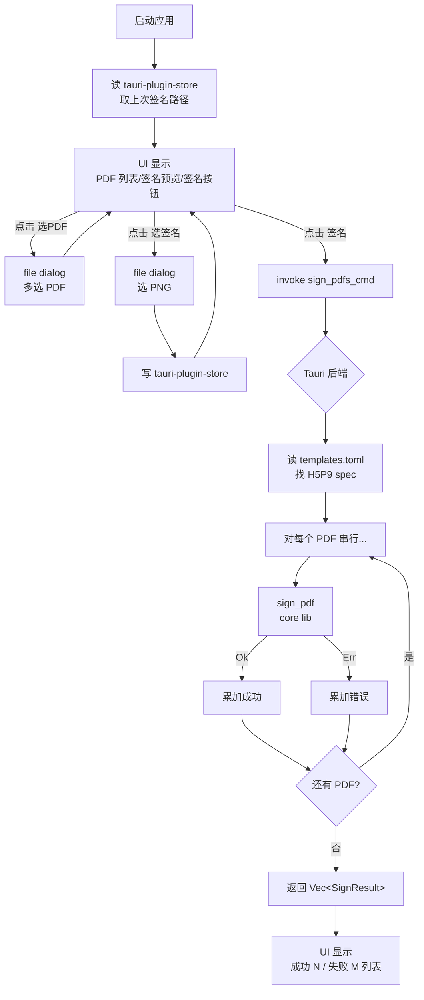

# PDF 批量签名 Design

> Stage 1 | 2026-05-20 | 下一步:implement

## 0. 术语约定

| 术语 | 定义 | 防冲突结论 |
|---|---|---|
| **视觉签章** (visual signature) | 把 PNG 图片叠到 PDF 页面上的"看起来像签名"做法,无密码学完整性保护 | 新项目无冲突 |
| **内容叠加** (content overlay) | 在 PDF 页面的 content stream 上追加图片绘制指令,**不动 XFA 表单字段** | 新项目无冲突 |
| **签名配置** (sign config) | `(page_index, x, y, width, height)` 四元组,描述某模板的签名落点 | 新项目无冲突 |
| **签名图** (signature image) | 用户选定的 PNG 透明背景图,渲染为签名 | 区别于"数字签名 (digital signature)",本项目不做数字签名 |
| **模板** (template) | 一类相同结构的 PDF(如 H5P9 月报),共享同一份签名配置 | 新项目无冲突 |
| **PDF 坐标系** | PDF 标准:**左下角为原点**,y 向上增加,单位 pt(1/72 英寸) | UI 显示可能用左上原点,转换在 boundary 做 |

## 1. 决策与约束

### 需求摘要

- **做什么**:批量给 ESI 月报 PDF 在 Page 2 固定位置(`ESI Engineer's Signature` 标签上方空白区)贴一张 PNG 签名图,输出新 PDF
- **为谁**:ESI 服务工程师,每月签提交的服务月报,团队内部使用
- **成功标准**:
  1. 选 N 份 H5P9 月报 + 1 张签名 PNG → 一键产出 N 份 `_signed.pdf`
  2. 签名图视觉上位于 `ESI Engineer's Signature` 上方,等比无变形,不覆盖日期
  3. 应用重启后默认填上次签名路径
- **明确不做**:
  - 不做 PKI / PAdES / eIDAS 数字签名(无密码学完整性保护)
  - 不在 UI 上交互框选签名位置(坐标走配置文件)
  - 不改动 PDF 的 XFA 表单字段(只在 content stream 叠图)
  - 不做 PDF 模板自动识别(本期只支持 H5P9 一种模板,新模板靠加配置)
  - 不做签名图编辑器(用户自备 PNG)
  - 本期不做并发批量处理(N 份 PDF 串行处理够用,N 通常 <12)

### 复杂度档位

走"团队内部桌面工具"默认档位:错误处理用 `anyhow` / `thiserror` 即可,无对外 SDK 兼容义务,无高并发需求。

### 关键决策

| # | 决策 | 被拒方案 | 影响名词层/编排层的方式 |
|---|---|---|---|
| K1 | 项目结构走 **Cargo workspace**:`crates/pdf-sign-core/` (lib) + `src-tauri/` (Tauri 后端,依赖 core) + `src/` (前端) | 单 crate 把所有东西塞进 `src-tauri/src/` | core lib 接口独立可测,将来加 CLI 子项目只需 `crates/pdf-sign-cli/`,不动 Tauri |
| K2 | PDF 操作选 `lopdf`(纯 Rust,MIT) | `pdfium-render` / `mupdf-rs` | core lib 不引入 C 动态库,Tauri 打包跨平台分发零额外步骤;但失去文本搜索能力,**定位强制走配置坐标** |
| K3 | 位置定位走 **TOML 配置文件**(`templates.toml`),不做文本搜索 | 运行时 grep PDF 文本找锚点 | core lib 接口只接受 `SignSpec`,定位逻辑外置;UI / config 决定用哪份 spec |
| K4 | 输出命名走 `<原名>_signed.pdf` 同目录 | 覆盖原文件 / 让用户选输出目录 | UI 不需要"选输出目录"控件;core lib `sign_pdf(input, sig, spec) -> output_path` 自动算 |
| K5 | 单 PDF 失败 → 记错继续,**最后汇总报告** | 整批回滚 / 首失败终止 | core lib 返回 `Vec<SignResult>` 而非 `Result<()>`;UI 显示汇总 |
| K6 | 前端栈选 **vanilla TS + Vite**(Tauri 官方模板) | React / Vue / Svelte | 不引入框架运行时,3 个控件 + 进度列表用原生 DOM 足够;构建产物最小 |
| K7 | 上次签名路径持久化用 **`tauri-plugin-store`**(官方插件) | 自己读写 JSON 文件 | 不增加自实现成本,跨平台路径处理交给插件 |

### 前置依赖

无。项目从零起,所有依赖在 implement 阶段安装。

---

## 2. 名词与编排

### 2.1 名词层

**现状**:无现状,项目从零。所有类型新建。

**变化(新增)**:

| 类型 | 落点 | 职责 |
|---|---|---|
| `SignSpec` | `crates/pdf-sign-core/src/spec.rs` | 描述某模板的签名落点(页码 + bbox) |
| `SignConfig` | `crates/pdf-sign-core/src/config.rs` | TOML 配置根:含多个 `TemplateSpec` |
| `TemplateSpec` | 同上 | 单个模板的识别规则 + 签名 spec |
| `SignError` | `crates/pdf-sign-core/src/error.rs` | 用 `thiserror` 定义错误枚举 |
| `SignResult` | `crates/pdf-sign-core/src/lib.rs` | 单个 PDF 的处理结果:成功路径 / 错误 |
| `AppState`(前端) | `src/state.ts` | UI 侧状态:选定的 PDF 列表、签名路径、处理进度 |

**接口示例**:

```rust
// 来源:crates/pdf-sign-core/src/spec.rs
pub struct SignSpec {
    pub page_index: usize,   // 0-based, H5P9 模板 = 1 (Page 2)
    pub x: f32,              // PDF 坐标 (左下原点), pt
    pub y: f32,
    pub width: f32,
    pub height: f32,
}

// 来源:crates/pdf-sign-core/src/lib.rs
/// 给单份 PDF 叠签名,输出新文件(原名 + _signed.pdf 同目录)
/// 输入:
///   - pdf_path: "/abs/path/H5P9-五月.pdf"
///   - signature_png_path: "/abs/path/zhang-xiang.png"
///   - spec: SignSpec { page_index: 1, x: 466.3, y: 110.0, width: 106.7, height: 40.0 }
///     (y 是 PDF 坐标,左下原点。PyMuPDF spike 报 y=502 是左上原点,换算 y_pdf = 612 - 502 = 110)
/// 输出:
///   - Ok("/abs/path/H5P9-五月_signed.pdf")
///   - Err(SignError::PdfLoadFailed { path, source }) — PDF 损坏 / 加密
///   - Err(SignError::PageOutOfRange { ... })         — page_index 超界
///   - Err(SignError::ImageLoadFailed { ... })        — 签名 PNG 损坏
///   - Err(SignError::OutputWriteFailed { ... })      — 磁盘写失败
pub fn sign_pdf(
    pdf_path: &Path,
    signature_png_path: &Path,
    spec: &SignSpec,
) -> Result<PathBuf, SignError>;

/// 批量版,串行处理,单失败不影响后续
pub fn sign_pdfs(
    pdf_paths: &[PathBuf],
    signature_png_path: &Path,
    spec: &SignSpec,
) -> Vec<SignResult>;

pub enum SignResult {
    Ok { input: PathBuf, output: PathBuf },
    Err { input: PathBuf, error: SignError },
}
```

```toml
# 来源:templates.toml(应用启动时从用户配置目录读取)
[[template]]
name = "H5P9"
match_pages = 2                    # 简单识别:页数匹配
signature = { page_index = 1, x = 466.3, y = 110.0, width = 106.7, height = 40.0 }
```

```typescript
// 来源:src-tauri/src/commands.rs Tauri command 暴露给前端
// 前端调用:
import { invoke } from '@tauri-apps/api/core'
const results: SignResult[] = await invoke('sign_pdfs_cmd', {
  pdfPaths: ['/.../H5P9-五月.pdf', '/.../H5P9-六月.pdf'],
  signaturePath: '/.../zhang-xiang.png',
  templateName: 'H5P9',
})
```

### 2.2 编排层

**主流程图**:



**现状**:无现状,项目从零。

**变化**:整个 workflow 新建。拓扑 = 线性 pipeline(单线程串行)。

**流程级约束**:

- **错误语义**:`sign_pdfs` 永不抛错;每个 PDF 独立成功/失败,UI 拿到完整 `Vec<SignResult>` 后渲染汇总
- **幂等性**:重复对同一 PDF 调用 `sign_pdf` 会**覆盖**先前的 `_signed.pdf`(没有版本号策略);用户应理解
- **并发**:本期无并发,串行处理。原因:N 通常 <12,串行 < 5 秒可接受;并发引入 panic 隔离复杂度不值
- **可观测点**:`sign_pdfs` 在每份 PDF 处理完后通过 Tauri event(`sign://progress`) 推前端进度,UI 显示"3/12 已完成"
- **配置加载策略**:`templates.toml` 应用启动时**一次性加载**,改配置要求重启;减少状态机复杂度

### 2.3 挂载点清单

判据:**"删掉这一项,feature 在用户/系统视角是不是就消失了?"**

| 挂载位置 | 具体文件或配置 key | 动作 |
|---|---|---|
| Tauri command 注册 | `src-tauri/src/main.rs` 的 `.invoke_handler(generate_handler![sign_pdfs_cmd])` | 新增 |
| Tauri 应用菜单/窗口入口 | `src-tauri/tauri.conf.json` 的 `app.windows[0]` | 新增 |
| `tauri-plugin-store` 持久化 key | key = `last_signature_path` | 新增 |
| 模板配置文件 | `templates.toml`(放用户配置目录,如 macOS `~/Library/Application Support/esi-pdf-sign/`) | 新增 |
| 前端启动入口 | `src/index.html` + `src/main.ts` | 新增 |

5 条,**全部 = 新项目的对外面**,无遗漏。删任一条 feature 在用户/系统视角即消失。

### 2.4 推进策略

按 paradigm 维度切片,最简 workflow 先行:

```
1. 工程骨架:建 workspace + crates/pdf-sign-core 空 lib + src-tauri 默认模板 + src 前端骨架
   退出信号:`cargo build` 全绿,`pnpm tauri dev` 能打开空窗口

2. core lib 编排骨架:实现 sign_pdf 但内部用 stub("假装贴图,直接复制原 PDF 加 _signed 后缀")
   退出信号:单测 1 条 — 输入存在的 PDF,输出 _signed.pdf 文件存在

3. core lib 计算节点(关键):lopdf 加载 PDF + 嵌入 PNG XObject + content stream 追加绘制指令
   退出信号:单测 — 处理真实 H5P9 PDF,用 pdfium-render(测试时引入)或人眼看输出 PDF,签名图在指定位置可见

4. core lib 批量 + 错误枚举:实现 sign_pdfs 串行循环 + SignError 各分支单测
   退出信号:单测覆盖 4 类错误(PDF 损坏 / 页码超界 / 图片损坏 / 写失败)

5. Tauri 后端集成:注册 sign_pdfs_cmd command + 配置加载 + progress event
   退出信号:在 Tauri dev 模式下从前端 invoke 能拿到结果

6. 前端 UI:静态结构 + 文件 dialog + 调用 command + 显示进度和汇总
   退出信号:浏览器/Tauri 窗口里完整跑通"选PDF→选签名→签名→看汇总"

7. 持久化:接入 tauri-plugin-store 记上次签名路径
   退出信号:重启应用,签名路径默认填上

8. 端到端验证:用真实 H5P9-五月.pdf + 张项签名跑完,Adobe Reader 打开输出确认视觉
   退出信号:验收契约第 3 节所有场景通过
```

### 2.5 结构健康度与微重构

##### 评估
- 文件级:本 feature 不修改已有文件(项目全新),无评估对象
- 目录级:**`crates/pdf-sign-core/src/` 目录** — 全新目录,本次会落 5-6 个文件(`lib.rs` / `spec.rs` / `config.rs` / `error.rs` / `overlay.rs` / 可能 `image.rs`)。属正常初始规模,未摊平
- 目录级:**`src-tauri/src/` 目录** — Tauri 默认模板会带 `main.rs` / `lib.rs`,本次新增 `commands.rs`(Tauri command 实现)+ 可能 `config.rs`(加载 templates.toml)。3-4 个文件,健康
- 目录级:**`src/` 前端目录** — 全新,本次落 `index.html` / `main.ts` / `state.ts` / `styles.css` 4 个文件。健康

##### 结论:**不做**

新项目从零起,所有文件按 paradigm 维度切分(spec / config / overlay / error 各一文件),目录初始就摊平有度。没有要拆的胖文件,没有要重组的拥挤目录。

##### 超出范围的观察

无。

---

## 3. 验收契约

### 关键场景

| # | 输入/触发 | 期望可观察结果 |
|---|---|---|
| S1 (正常) | 选 1 份 `H5P9-五月.pdf` + 张项签名 PNG,点签名 | 同目录生成 `H5P9-五月_signed.pdf`,用 Preview 打开 Page 2 能看到签名图位于 `ESI Engineer's Signature` 上方空白区,不覆盖 `May 20, 2026` 日期 |
| S2 (批量) | 选 3 份 H5P9 PDF + 同一张签名,点签名 | 3 份 `_signed.pdf` 均生成,UI 显示 "3/3 成功",进度条按完成度更新 |
| S3 (持久化) | 第一次选签名 A 后关闭应用,重启 | UI 默认填上签名 A 的路径(从 store 读) |
| S4 (重复签) | 对已签名的 PDF 再次签名 | `_signed.pdf` 被覆盖,日志/UI 提示曾覆盖(可选) — **本期默认覆盖不警告** |
| S5 (边界:加密 PDF) | 选一份加密 PDF | 该文件状态 = 失败,错误信息 "PDF 加密无法处理",其他正常 PDF 仍处理完成 |
| S6 (边界:页数不足) | 选一份只有 1 页的 PDF(不是 H5P9 模板) | 该文件状态 = 失败,错误信息 "页码超界 / 模板不匹配",其他正常 PDF 仍处理完成 |
| S7 (边界:图片损坏) | 选一个不存在或损坏的 PNG 作为签名 | 整批不启动,UI 报"签名图无法加载",不产生输出文件 |
| S8 (边界:磁盘只读) | 输出目录无写权限 | 该文件状态 = 失败,错误信息 "写文件失败 + OS 错误码" |

### 明确不做的反向核对项

| 反向核对 | 验证方法 |
|---|---|
| 不应产生 PKI 数字签名 | `pdfsig` 工具 / Acrobat 签名面板 → 输出 PDF 无 "数字签名" 字段 |
| 不应改动 XFA 表单字段 | `qpdf --json` 输出对比 → AcroForm / XFA 节点 = 输入相同 |
| 不应有"UI 上手动框选位置"的代码 | grep 前端代码无 `<canvas>` 框选 / 拖拽逻辑 |
| 不应做模板自动识别(本期) | grep core lib 无 OCR / 文本搜索 / 模板匹配启发式 |
| 不应有并发批量(本期) | grep core lib `sign_pdfs` 实现无 `rayon` / `tokio::spawn` / `thread::spawn` |
| 不应内置签名图编辑器 | 前端无 paint / draw / sign-pad 组件 |

---

## 4. 与项目级架构文档的关系

**当前状态**:`codestable/architecture/` 不存在,项目尚无架构文档。

**预判 acceptance 阶段要建并提炼以下内容**:

- **架构总入口** (`codestable/architecture/ARCHITECTURE.md`):本次 feature acceptance 阶段创建。结构:
  - 概览:工具定位 / 用户 / 部署形态(Tauri 桌面应用)
  - 模块拓扑:`pdf-sign-core` ← `src-tauri` ← `frontend` 三层
  - 已知约束:见下
- **结构与交互**节(待新建):
  - `pdf-sign-core` 对外契约 = `sign_pdf` / `sign_pdfs` / `SignSpec` / `SignError`
  - Tauri command 契约 = `sign_pdfs_cmd`(invoke 参数 + 返回结构)
- **数据与状态**节:
  - 持久化 = `tauri-plugin-store` 单 key `last_signature_path`
  - 配置 = `templates.toml`(用户配置目录)
- **已知约束**:
  - 不动 XFA 表单,只叠 content stream(K2 / K3 决策)
  - PDF 模板靠配置文件区分,无自动识别
  - 串行处理(本期)

acceptance 阶段创建上述文件并把本 design 链接进去。
